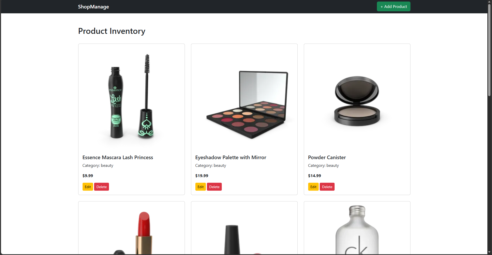
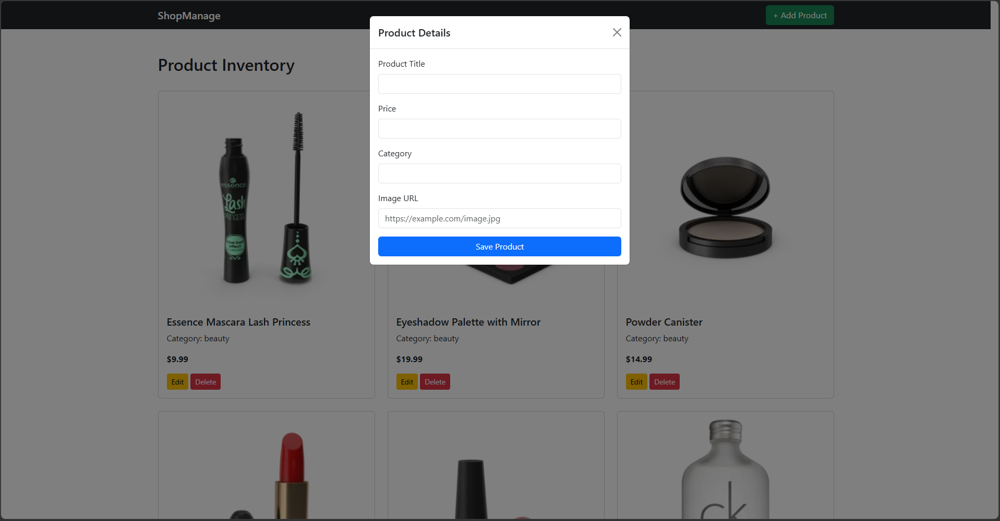

# ShopManage-Inventory-Dashboard

This project is a fully working inventory dashboard web application. It uses DummyJSON API for demonstration and testing purposes.

## Features
- Inventory management dashboard UI
- Uses DummyJSON API for sample data
- Responsive design with HTML, CSS, and JavaScript

## How to Run
Open `index.html` in your browser. No additional setup is required.

## Screenshots
<!-- Add your screenshots below. -->

